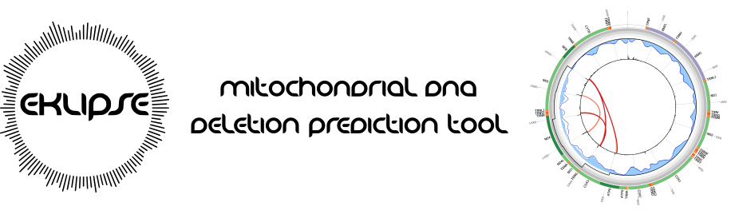
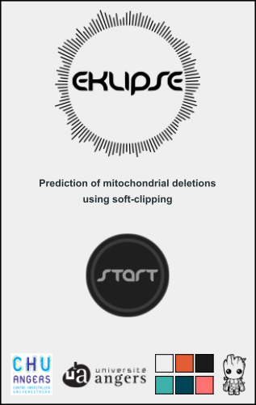
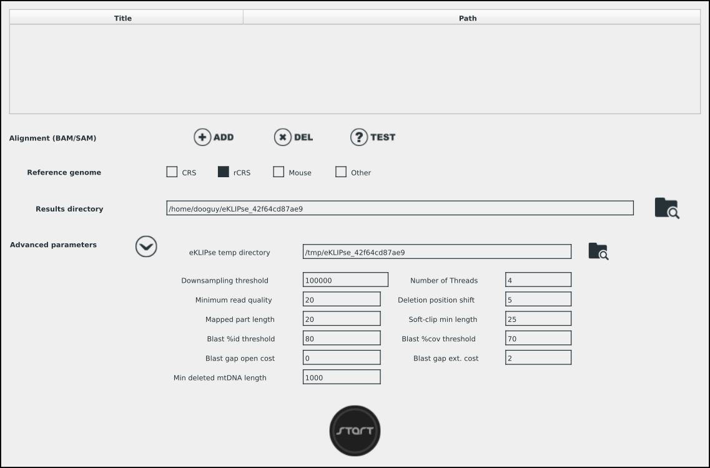
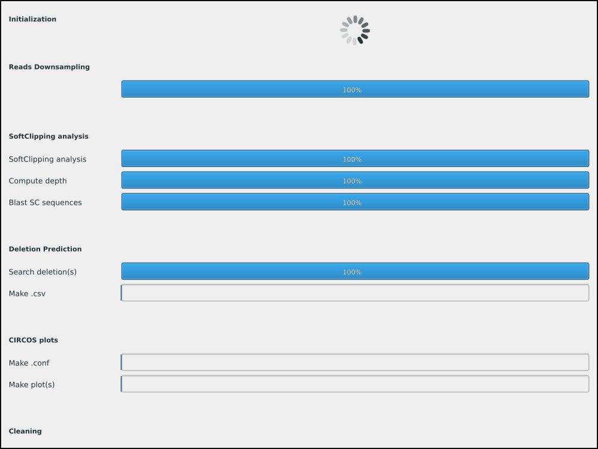
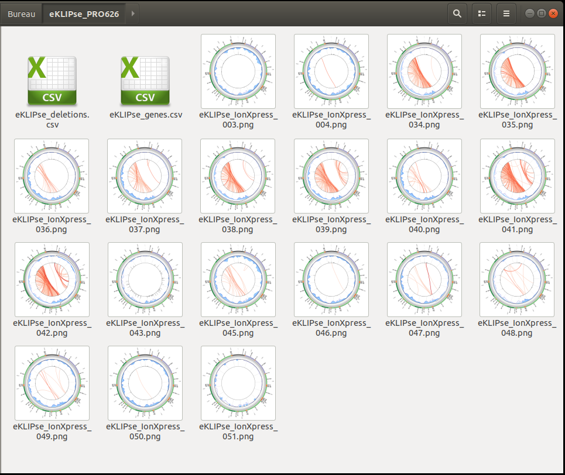
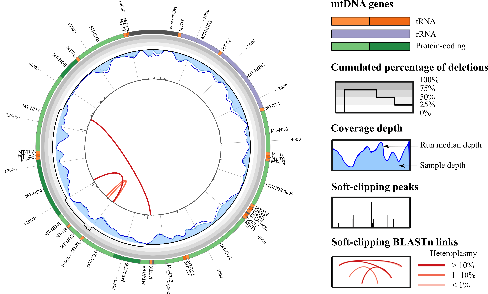

<b>eKLIPse is a sensitive and specific tool allowing the detection and quantification of large mtDNA rearrangements.</b><br/>
Based on soft-clipping it provides the precise breakpoint positions and the cumulated percentage of mtDNA rearrangements at a given gene location with a high detection sensitivity.<br/>
Both single and paired-end (mtDNA, WES, WGS) data are accepted.<br/>
eKLIPse requires two types of input, the BAM or SAM alignment files (with header) and the corresponding mitochondrial genome (GenBank format).<br/>
<b>Alignment must contains soft-clipping information (see your aligner options).</b><br/>
eKLIPSE is available either as a script to be integrated in a pipeline, or as user friendly graphical interface.<br/>
```diff
- Like others CNV tools, eKLIPse performance will depend on your sequencing and mapping steps.
```

---------------------------------------

## Graphical User Interface (Qt)

#### Windows Deployment (portable)
- download lastest version 080620 [here](https://163.172.45.124/owncloud/index.php/s/p0Skh2dJB3pYJc8/download).<br/>
- unzip ZIP file.<br/>
- launch 'eKLIPse.exe'

```diff
- Space not allowed in executable and input/output path
```
##

#### Linux Installation
- install required tools (see Requirements section)
- download lastest version [here](https://163.172.45.124/owncloud/index.php/s/utlrdhe72lqymxR/download)).<br/>
- unzip Qt_eKLIPse_unix_v1-0.zip
- cd Qt_eKLIPse_unix_v1-0.zip
- chmod a+x eKLIPse
- ./eKLIPse
##

#### Running
##### Start
{ width=30% }<br/>
To start analysis, simply click "START".<br/>
(you can change the colors by clicking on the bottom right colors)<br/>
##### Launch Analysis
<br/>
1 - To select your alignment files, click "ADD". If required you can change alignment title by selecting corresponding cell.<br/>
2 - Select your reference genome. If you choose "Other", browse to your own Genbank file by clicking on the folder icon.<br/>
3 - To change "results directory", click on the folder icon.<br/>
4 - To modify "Advanced parameters" click on the expand icon. Please refers to "Parameters" section for further information.<br/>
5 - Launch analysis by clicking "START"<br/>
##### Analysis in progress
<br/>
eKLIPse analysis detailed progress can be followed on this window.<br/>
##### Results
<br/>
Once the analysis is complete, the program automatically opens the result folder.
##

#### Testing
Two reduced alignment files are provided with the archive file.<br/>
Click "TEST" on the "Launch Analysis" windows before clicking "START".
<br/><br/>

---------------------------------------

## Command Line Interface

#### Docker
A docker image is also available. Follow building instruction [here](https://docs.docker.com/get-started/part2/#build-the-app)
##

#### Linux

##### Requirements
Please install the following modules & tools:<br/>
- python 2.7<br/>
- [biopython](https://github.com/biopython/biopython)<br/>
- [tqdm](https://github.com/tqdm/tqdm)<br/>
- [samtools](https://github.com/samtools/samtools)<br/>
- [blastn & makeblastdb](http://ftp.ncbi.nlm.nih.gov/blast/executables/blast+/LATEST/) (>=2.3.0+)<br/>
- [circos](http://circos.ca/software/download/)<br/>


##### Testing

```markdown
python eKLIPse.py --test

(*add "-samtools", "-blastn", "-makeblastdb" and "-circos" options if not in $PATH)
```


##### Running

```markdown
python eKLIPse.py -in <INPUT file path> -ref <GBK file path> [OPTIONS]

[OPTIONS]
-out          <str>  : Output directory path                  [current]
-tmp          <str>  : Temporary directory path               [/tmp]
-scsize       <int>  : Soft-clipping minimal length           [25]
-mapsize      <int>  : Upstream mapping length                [20]
-downcov      <int>  : Downsampling read number               [500000] (0=disable)
-minq         <int>  : Read quality threshold                 [20]
-minlen       <int>  : Read length threshold                  [100]
-shift        <int>  : Breakpoint sliding-window size         [5]
-minblast     <int>  : Minimal number of BLAST per breakpoint [1]
-bilateral    <bool> : Filter unidirectional BLAST            [True]
-mitosize     <int>  : Remove deleted mtDNA less than         [1000]
-id           <int>  : BLAST %identity threshold              [80]
-cov          <int>  : BLAST %coverage threshold              [70]
-gapopen      <int>  : BLAST cost to open a gap               [0:proton, 5:illumina]
-gapext       <int>  : BLAST cost to extend a gap             [2]
-thread       <int>  : Thread number                          [2]
-samtools     <str>  : samtools bin path                      [$PATH]
-blastn       <str>  : BLASTN bin path                        [$PATH]
-makeblastdb  <str>  : makeblastdb bin path                   [$PATH]
-circos       <str>  : circos bin path                        [$PATH]
--test               : eKLIPse test
--nocolor            : Disable output colors
```

---------------------------------------

## Parameters

##### Input file (-in)
eKLIPse accepts alignments in BAM or SAM format (require header) for both single and paired-end sequencing data.<br/>
The input file is a simple tabulated text file as follow:<br/>
<table><tbody><tr><td>path_bam</td><td>title1</td></tr><tr><td>path_bam2</td><td>title2</td></tr></tbody></table>
##

##### mtDNA reference (-ref)
eKLIPse accepts any mtDNA reference genome in Genbank format.<br/>
rCRS (NC_012920.1.gb), CRS (J01415.2.gb) and *Mus musculus* (NC_005089.1.gb) are provided in "/data"
##

##### Downsampling (-downcov)
In order to reduce the execution time, a downsampling option is available.<br/>
For singles deletions with low mutant load or multiple deletions, we advise to not downsample "-downcov 0".<br/>
The obtained read number should match to a sufficient mitochondrial genome coverage.
##

##### Sequencing & Alignment (-minq / -minlen)
According to your sequencing technology and library, you can adjust the minimum read length value (-minlen).<br/>
You can adjust minimum read quality (-minq), for example to consider multiple hits for a same read which reduce the minq.
##

##### Soft-clipping (-minq / -minlen)
For short read data, we advise to reduce minimal soft-clipping length (-scsize) and upstream mapping length (-mapsize).<br/>
For example, with 100bp reads, you could use "-scsize 15" and "-mapsize 10".<br/>
Breakpoint sliding-window size could be modify if you expect a high number of homopolymers.
##

##### BLASTn (-id / -cov / -gapopen / -gapext )
BLASTn thresholds are mostly sequencing technology dependent.<br/>
Then according to your sequencing quality you could increase or decrease identity and coverage thresholds (-id / -cov).<br/>
Illumina is known to generate fewer errors and can therefore be more stringent on gap thresholds (-gapopen / -gapext).<br/>
For example, with illumina reads, you could use "-gapopen 5" and "-gapext 2".
##

##### Filtering (-minblast / -bilateral / -mitosize)
According to your sequencing depth, quality and required stringency, you could modify filters.<br/>
Increasing the minimum number of BLAST per breakpoint increase the specificity but decrease the sensitivity (-minblast)<br/>
By default, eKLIPse filter out deleted mtDNA with a length under 1000bp.<br/>
But for example, if you're looking for sublimons you could reduce this length to 100bp.<br/>
eKLIPse is based on the search of bidirectional BLAST linking 5' and 3' breakpoints.<br/>
It is therefore not recommended to disable this filter ("-bilateral False").<br/>


---------------------------------------


## Outputs

#### eKLIPse_deletions.csv
File containing all predicted deletions (bkp=breakpoint).<table style='font-size:80%'><tr><td>Title</td><td>5'bkp</td><td>3'bkp</td><td>Freq</td><td>Freq for</td><td>Freq rev</td><td>5' Blast</td><td>3' Blast</td><td>5' Depth</td><td>3' Depth</td><td>Repetition</td></tr><tr><td>file1</td><td>7753</td><td>14601</td><td>3,46</td><td>0,38</td><td>6,55</td><td>2</td><td>23</td><td>1393</td><td>412</td><td>7754-GA-7755 | 14601-GA-14602</td></tr><tr><td>file2</td><td>7981</td><td>14955</td><td>7,40</td><td>4,28</td><td>10,51</td><td>2408</td><td>2506</td><td>7080</td><td>2544</td><td>7982-CT-7983 | 14955-CT-14956</td></tr><tr><td>file3</td><td>460</td><td>5243</td><td>7,24</td><td>13,72</td><td>0,76</td><td>7</td><td>1</td><td>72</td><td>197</td><td>458-CT-459 | 5242-CT-5243</td></tr></table>
##

#### eKLIPse_genes.csv
File summarizing cumulated deletions per mtDNA gene.<table style='font-size:80%'><tr><td>Gene</td><td>Start</td><td>End</td><td>Type</td><td>file3</td><td>file4</td><td>file5</td></tr><tr><td>MT-TF</td><td>577</td><td>647</td><td>trna</td><td>0,38</td><td>0,82</td><td>14,03</td></tr><tr><td>MT-RNR1</td><td>648</td><td>1601</td><td>rrna</td><td>2,27</td><td>14,42</td><td>14,03</td></tr><tr><td>MT-TV</td><td>1602</td><td>1670</td><td>trna</td><td>2,27</td><td>14,42</td><td>14,03</td></tr><tr><td>MT-RNR2</td><td>1671</td><td>3229</td><td>rrna</td><td>2,27</td><td>14,78</td><td>14,03</td></tr><tr><td>MT-TL1</td><td>3230</td><td>3304</td><td>trna</td><td>2,27</td><td>14,78</td><td>14,03</td></tr><tr><td>MT-ND1</td><td>3307</td><td>4262</td><td>protein</td><td>2,27</td><td>15,05</td><td>14,03</td></tr></table>
##

#### circos plot
One plot is created per input alignment. An example is shown below.<br/><br/>

##

### Contact
dooguy@tuta.io


### License
eKLIPse is available under the GNU Affero General Public License v3.0.


### Reference
Please cite (submitted article)

eKLIPse: A sensitive tool for the detection and quantification of mitochondrial DNA deletions from next generation sequencing data.


